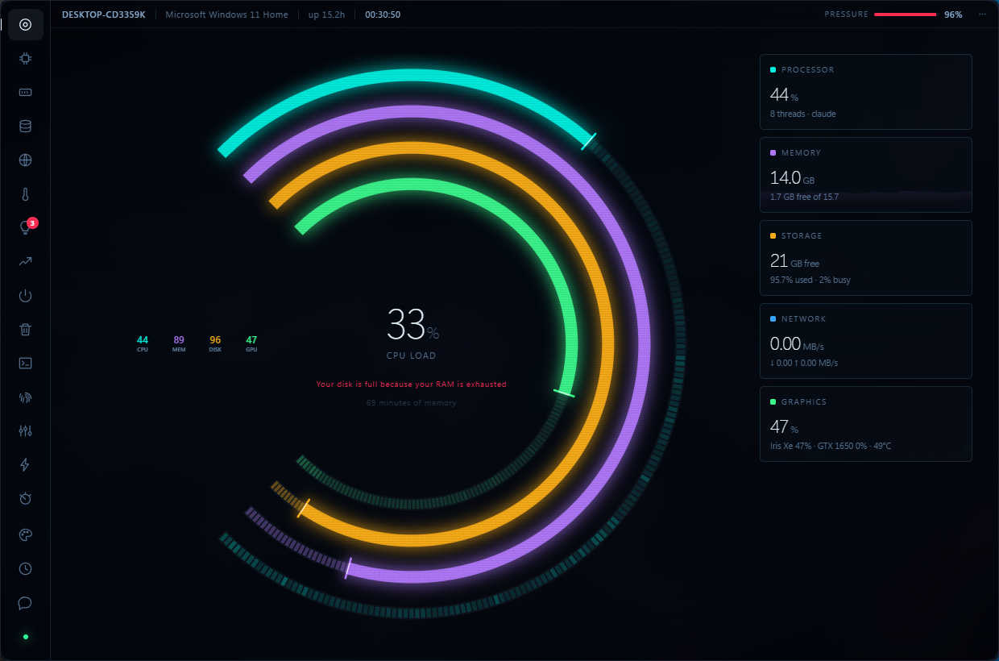

# bmconsult

Public projects. Each folder is self-contained — its own README, its own licence.

---

### [VITALS](vitals/) &nbsp;·&nbsp; a system monitor that never shows you a number it did not measure

Most monitors draw a zero when the machine can't answer. VITALS refuses: an absent gauge means *this
host cannot measure that*, a dash means *not measured*, and `0%` means genuinely zero. A capability
manifest declares per platform what is honestly answerable and the interface is gated on it, so a
new page cannot quietly ship a platform assumption.

On top of that: a diagnosis engine that ranks by consequence rather than by the biggest number and
cites what happened last time each finding fired on *your* machine, cleanup that measures what it
actually freed, and an optional Claude conversation grounded in live telemetry.

Windows · macOS · Linux &nbsp;·&nbsp; no installer, no service, no accounts, no telemetry &nbsp;·&nbsp; Apache-2.0

**[Download](vitals/#download)** &nbsp;·&nbsp; **[Read more](vitals/)**
