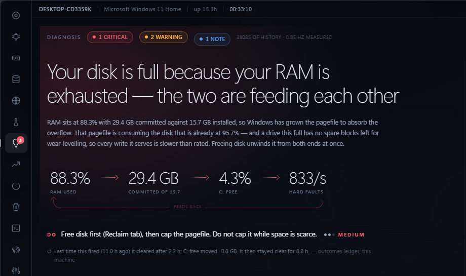
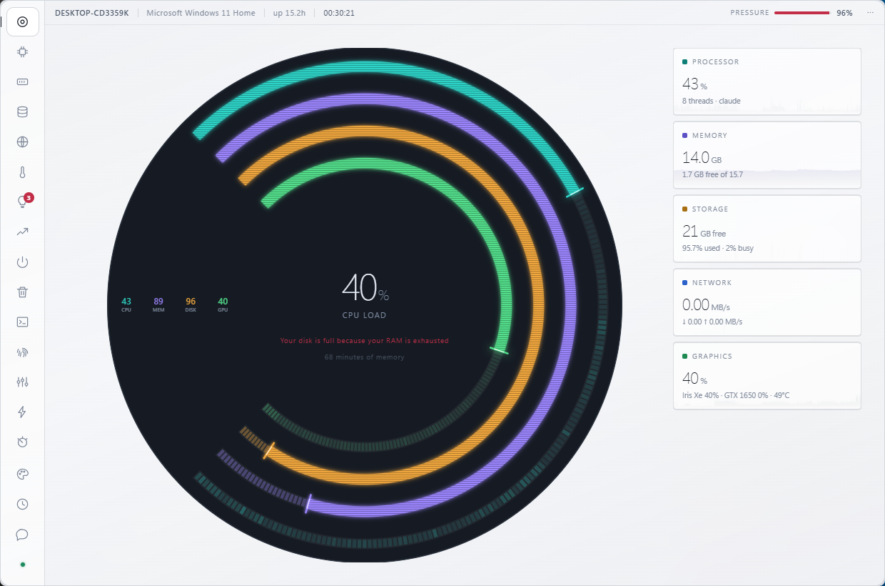
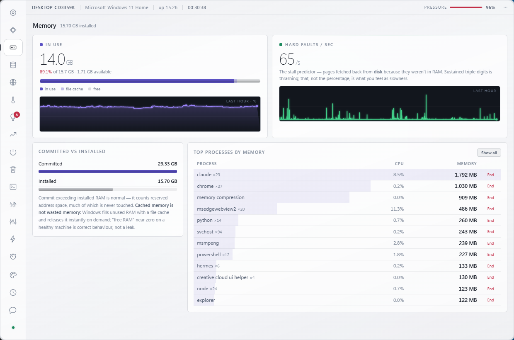

<p align="center">
  
</p>

<h1 align="center">VITALS</h1>

<p align="center"><b>A system monitor that never shows you a number it did not measure.</b></p>

<p align="center">
  Windows · Linux · macOS &nbsp;·&nbsp; zero dependencies &nbsp;·&nbsp; no installer, no service, no accounts, no telemetry &nbsp;·&nbsp; Apache-2.0
</p>

---

<p align="center">
  
</p>

## The rule

Every monitor faces the same temptation: when the host can't measure something, draw a zero.
VITALS was built around refusing that, because a gauge stuck at 0% while the thing it watches is
pegged *answers* your question — wrongly, and confidently. A blank *prompts* it.

So in VITALS:

- **An absent gauge** means *this machine cannot measure that* — and the FOOTPRINT page tells you why.
- **A dash** means *not measured*.
- **`0%`** means genuinely zero.

This is enforced structurally, not by good intentions. A capability manifest
([`collect/caps.js`](collect/caps.js)) declares per platform what the host can honestly answer —
`true`, `'partial'` with a note, or `false` — and the panel gates every feature on it. Adding a
feature to the UI means adding it to the manifest first, so a new page cannot silently ship a
platform assumption. `null` travels through the whole pipeline rather than being defaulted to `0`.

The lesson was paid for on the reference machine: reading only the discrete GPU showed "GPU 0%"
while the integrated GPU was doing all the work. That bug is why the manifest exists.

## What it is

A folder, a Node runtime, and nothing else. Copy the folder, run one command. No npm packages
(`node_modules` does not exist and nothing creates one), no registry keys, no background service,
no accounts, and nothing leaves the machine except two things you explicitly press: the network
speed test, and the optional Claude-backed **Ask** page — which ships disconnected and sends
nothing until you press Connect.

What you get:

- **Live telemetry** — per-core CPU, memory with honest cache accounting, per-process CPU/memory,
  disk and network rates, GPU, battery health — drawn as trailing rings that show the last few
  minutes, not the instant you happened to glance.
- **A diagnosis engine** ([`diagnose.js`](diagnose.js)) that ranks findings by *consequence*, not by
  the biggest number. Every rule tests a **sustained** condition against minutes of history — a CPU
  spike is a process starting; ninety seconds of it is a problem. Compound rules outrank their
  parts: *"the disk is full because the pagefile grew because RAM is exhausted"* is one finding
  that explains two symptoms, and it suppresses both rather than listing all three. Each finding
  carries its evidence and, where there is something to do, points at the page that does it.
- **Growth tracking** — what got bigger while you weren't looking, diffed over time.
- **Reclaim** — every cleanup target sized *before* you act and labelled safe / deliberate /
  surfaced-only. The Recycle Bin is shown, never emptied for you. Afterwards an outcomes ledger
  records what was *actually* freed — if a cleanup claimed 9 GB and gave back 200 MB, the ledger
  says so.
- **Ask** — an optional Claude conversation grounded in the machine's live telemetry. Every question
  carries a deliberately anonymous summary (no process names, no account name, no paths); detail is
  fetched per-question only when a question needs it.
- **An MCP server** ([`vitals-mcp.js`](vitals-mcp.js)) so your own Claude sessions can query the
  machine's telemetry. Read-only unless you pass `--allow-actions`.
- **A frameless panel** (Windows) that docks to a screen edge as a live sidebar or topbar, with
  themes, keyboard paging, and a pop-out chat window.

<p align="center">
  
</p>

## Download

Portable bundles carry their own Node runtime — **nothing to install first, on any platform.** Each
link downloads directly; unpack it and run Setup.

| | Download | Size | Then |
|---|---|---|---|
| **Windows** | **[⬇ vitals-0.9.0-win-x64.zip](https://github.com/bmconsult/public/releases/download/vitals-v0.9.0/vitals-0.9.0-win-x64.zip)** | 35 MB | Extract → double-click **`Setup.cmd`** |
| Windows on ARM | [⬇ vitals-0.9.0-win-arm64.zip](https://github.com/bmconsult/public/releases/download/vitals-v0.9.0/vitals-0.9.0-win-arm64.zip) | 31 MB | Extract → double-click **`Setup.cmd`** |
| **macOS** (M1–M4) | **[⬇ vitals-0.9.0-mac-arm64.tar.gz](https://github.com/bmconsult/public/releases/download/vitals-v0.9.0/vitals-0.9.0-mac-arm64.tar.gz)** | 39 MB | `tar -xzf …`, then `./setup.sh` |
| macOS (Intel) | [⬇ vitals-0.9.0-mac-x64.tar.gz](https://github.com/bmconsult/public/releases/download/vitals-v0.9.0/vitals-0.9.0-mac-x64.tar.gz) | 40 MB | `tar -xzf …`, then `./setup.sh` |
| **Linux** | **[⬇ vitals-0.9.0-linux-x64.tar.gz](https://github.com/bmconsult/public/releases/download/vitals-v0.9.0/vitals-0.9.0-linux-x64.tar.gz)** | 44 MB | `tar -xzf …`, then `./setup.sh` |

<details>
<summary><b>Not sure which one?</b></summary>

- **Windows** — take the first one. Almost every PC is x64. Only take *Windows on ARM* if you know
  you have a Snapdragon machine (Surface Pro X and similar); if you are not sure, you don't.
- **macOS** — any Mac from late 2020 onwards is Apple Silicon (M1, M2, M3, M4). Older Macs are
  Intel. Apple menu → About This Mac tells you in one line.
- **Linux** — x64 covers desktop and laptop machines. There is no ARM build yet.

Picked the wrong one? Nothing breaks — it simply will not start, and no installer has touched
anything, because there is no installer.

</details>

Every bundle is listed with its SHA-256 in
[`SHA256SUMS.txt`](https://github.com/bmconsult/public/releases/download/vitals-v0.9.0/SHA256SUMS.txt),
and the build is reproducible — rebuild from source with `node bundle.js` and you get the same hashes.

> On macOS and Linux use the `.tar.gz` — zip does not carry the executable bit.
> The binaries are **unsigned**; Windows SmartScreen and macOS Gatekeeper will warn accordingly.

Setup verifies every file it shipped with, probes what this platform can measure, then takes a real
reading of your machine and shows it to you — there is no progress bar estimating anything; the
numbers on that screen are the work it actually did. The optional extras (shortcuts, start at
login, MCP registration) are all **off** by default, and re-running Setup later shows what you
chose and lets you untick it.

### Or run it from this folder

Needs Node **18.15+** (that exact minor matters — `fs.statfsSync` arrived in 18.15):

```bash
node start.js
```

Full details, launchers per platform, ports, and troubleshooting: **[INSTALL.md](INSTALL.md)**.
What to do with it once it's running: **[USING.md](USING.md)**. There is even an
**[INSTALL_FOR_CLAUDE.md](INSTALL_FOR_CLAUDE.md)** — a step-by-step written for an AI agent
installing VITALS on your behalf, including the check it must not skip: proving the collector
actually produced telemetry before reporting success.

## Platform support, honestly

This is version **0.9.0**, and pre-1.0 on purpose. The version number is doing the same job as
everything else here: describing what was actually verified.

Counts below come from the capability manifest itself, not from a summary of it — 33 capabilities,
each declared per platform as measured, partial, or absent.

| | Windows | Linux | macOS |
|---|---|---|---|
| **Capabilities measured** | **32 of 33** | 11 measured · 7 partial | 9 measured · 3 partial |
| **Verified** | on real hardware, daily | 37 parser + 6 stimulus checks, real hardware | **simulation only — never run on a Mac** |
| CPU total | ✅ | ✅ | ✅ |
| CPU per-core | ✅ | ✅ | ❌ |
| Memory in use · cache · hard faults | ✅ | ✅ | ✅ |
| Memory committed | ✅ | ✅ | ❌ |
| Disk per volume | ✅ | ✅ | ✅ |
| Disk I/O · per device | ✅ · ✅ | ✅ · ❌ | ⚠️ partial · ❌ |
| Network rates | ✅ | ✅ | ✅ |
| Network per interface · sockets | ✅ | ❌ | ❌ |
| Processes: list · memory | ✅ | ✅ | ✅ |
| Processes: CPU · I/O · faults | ✅ | ✅ · ⚠️ · ✅ | ⚠️ · ❌ · ❌ |
| GPU | ✅ per-adapter & per-process | ⚠️ partial, driver-dependent | ❌ needs root |
| Battery, including health | ✅ | ⚠️ partial | ✅ |
| Diagnosis · history · journal | ✅ | ✅ | ✅ over the metrics it has |
| Actions & scans (kill, clean, restart, startup, growth, MFT) | ✅ | ❌ not ported | ❌ not ported |
| Frameless docking window | ✅ (x64) | browser window | browser window |

**Read that as: Windows is the product. Linux and macOS are real ports, not stubs — you get live
telemetry, the diagnosis engine, 90 days of history and the journal on all three — but they are
partial, and only Windows can act on what it finds.** A Mac gives you CPU, memory, disk, network,
processes and full battery health with diagnosis over all of it; it does not give you per-core CPU,
GPU, or any of the action buttons. That is worth having and it is not parity, and the table says
which is which rather than averaging them into a tick.

- **Windows** is the reference implementation — every capability observed working on a real
  machine. One gap: Windows exposes no CPU temperature to unprivileged code, so temperature appears
  only if LibreHardwareMonitor is running. **Non-English Windows** cannot resolve the localized
  performance counter names — VITALS detects this and reports those capabilities as unavailable
  rather than as zero.
- **Linux** was verified end to end on Ubuntu 22.04: 37 correctness checks cross-referenced against
  `df`, `free -m`, `nproc` and `/proc/meminfo` — independent sources, because a collector agreeing
  with itself proves nothing — plus 6 stimulus checks confirming the counters actually *move* under
  applied CPU, disk and network load. The caveat is stated in the manifest itself: that host was a
  VM with no battery, GPU or thermal zones, so those paths are only proven to return nothing
  *correctly*, and are marked `'partial'` until someone runs them populated.
- **macOS** was written from documented tool output on a machine that has no Mac. The panel says so
  in its header and will keep saying so until someone runs it and confirms the numbers. The
  simulated suite (64 checks driving the whole collector through fixtures) cannot prove macOS emits
  what was assumed — but it did catch three real bugs before shipping, including a `df` parser that
  silently dropped the main disk. **If you have a Mac, you can settle this in minutes** — see
  [Testing](#testing).

The actions layer is PowerShell, which is why it is Windows-only today. Linux could do nearly all
of it; the manifest marks it `false` because a manifest describes what is *implemented*, not what
is possible.

## Security posture

- **Loopback only.** The bridge binds to `127.0.0.1` and there is no hosted mode. Because a local
  browser can still reach loopback, the bridge also refuses any request with a non-loopback
  `Origin` (including the `null` origin a sandboxed iframe sends) or a non-loopback `Host` header —
  which is what DNS rebinding looks like. A web page you happen to be viewing cannot drive this
  machine.
- **Ask ships disconnected**, enforced in the bridge, not just hidden in the page. Your API key and
  admin passphrase live *outside* the install folder (`%LOCALAPPDATA%\vitals` /
  `~/.local/share/vitals`), out of reach of Ask's file tools by construction rather than by deny
  list.
- **Viewer mode** turns the install read-only at the bridge — hiding buttons would be theatre, so
  the router refuses and the panel hides controls as a consequence. Viewer also withholds anything
  that names your files and strips paths and account names from findings. It is a guardrail, not a
  security boundary, and the docs say exactly where the boundary actually is.
- **Support bundles are allowlists** — logs and metrics, never your clipboard, key, or file
  listings, with a manifest stating exactly what went in.

## Testing

Seven suites, and [INSTALL.md](INSTALL.md#testing-a-collector) is explicit about what a pass in each
actually proves — parser fixtures prove field offsets, live suites prove reality, stimulus suites
prove the numbers move.

```bash
npm test           # routes + parser fixtures + the macOS simulation (any platform)
npm run test:linux # live cross-check against df/free/nproc + stimulus (Linux)
npm run test:macos # live cross-check (macOS — this is the run the project needs)
```

Own a Mac? `bash tools/capture-macos-fixtures.sh` is read-only, needs no admin, produces one file,
and turns the macOS simulation into verification. That single capture is currently the most
valuable contribution anyone can make to this project.

## Screenshots

| | |
|---|---|
|  |  |
| *The same overview in the light theme.* | *Memory, read correctly: hard faults are the number that predicts what you actually feel, and "free RAM near zero" is normal.* |

## License

Apache-2.0 — see [LICENSE](LICENSE). The three Microsoft WebView2 DLLs in `lib/` are redistributed
under Microsoft's SDK licence and documented in [NOTICE.md](NOTICE.md). Everything else is original
work using only the Node.js and .NET standard libraries, PowerShell, and the operating system's own
interfaces.
